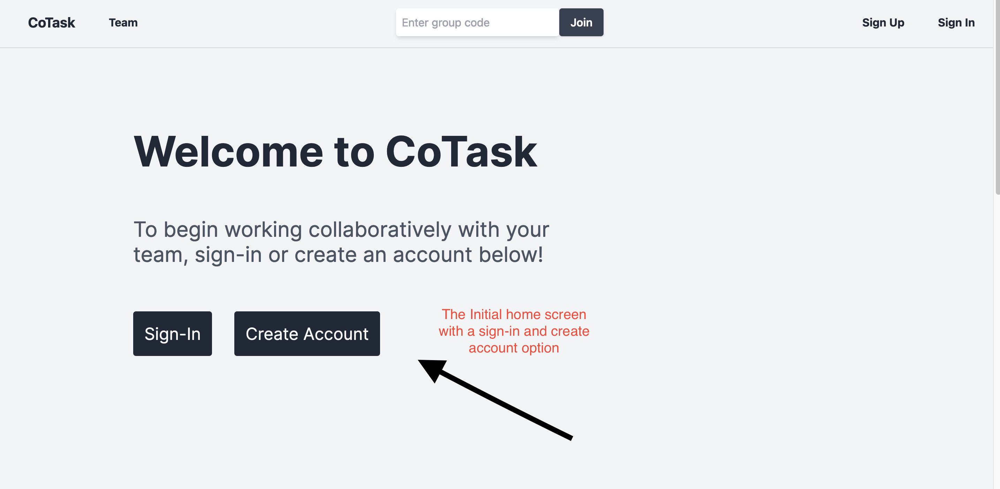

# Introduction

Institute: 
University of California, Los Angeles - Samueli School of Engineering

Course: 
Computer Science 35L Winter 24

Project Title:
CoTask

Overview:
This application, developed as a React web application, aims to streamline task management, providing users with an easily accessible and user-friendly platform for sharable task management. Users can group together by creating a server and joining through a QR code or link, fostering seamless collaboration. This enables group members not only to create tasks but also to share them with one another, promoting efficient teamwork. The ability to make comments or log progress updates ensures clear communication within the group.

Key Features:
1. User authentication
    Enable secure access to the system by allowing users to create accounts with unique credentials and authenticate themselves during logins.
2. User profile
    Provide users with a dedicated space to view and edit their profile information.
3. Group creation
    Allow users to create collaborative groups where they can organize and manage tasks collectively.
4. Group invitation
    Enable users to invite others to join their groups through a generated URL or an invitation mechanism.
5. Task management
    Users can create, edit, delete tasks, and track the progress of individual tasks.
6. Task comments with search
    Enhance communication within the group by providing a comment system for tasks, enabling users to search comments.

Technology Stack:
Node.js / React / Next.js / Tailwind CSS / PostgreSQL 
Next.js App Router / Fetch HTTP Request / JWT Authentication
Git

# Components

1. Backend
    APIs:
    `GET    /api/session`:  Retrieves the current users' session info. 
                            (Require JWT Auth token)

    `GET    /api/get-group`: Fetches details of a specific group by its ID. 
                            (Require JWT Auth token)

    `GET    /api/get-groups`: Retrieves a list of all groups available.
                            (Require JWT Auth token)

    `GET    /api/get-join-group`: Checks if a user can join a specified group.
                            (Require JWT Auth token)

    `GET    /api/get-task`: Fetches details of a specific task by its ID.
                            (Require JWT Auth token)

    `GET    /api/get-tasks`:  Retrieves a list of tasks within a specific group.
                            (Require JWT Auth token)

    `GET    /api/get-comments`: Fetches comments related to a specific task.
                            (Require JWT Auth token)

    `POST   /api/signin-user`: Authenticates a user and initiates a session.

    `POST   /api/register-user`: Registers a new user.

    `POST   /api/create-group`: Creates a new group for users to join.
                            (Require JWT Auth token)

    `POST   /api/join-group`: Adds a user to an existing group.
                            (Require JWT Auth token)

    `POST   /api/create-task`: Creates a new task within a group.
                            (Require JWT Auth token)

    `POST   /api/create-comment`: Adds a comment to a group.

    `PUT    /api/edit-task`: Updates the details of an existing task.
                            (Require JWT Auth token)

    `DELETE /api/delete-task`: Removes a task within a group.
                            (Require JWT Auth token)

2. Frontend
    The frontend of the application is built using React, a powerful JavaScript library for building user interfaces, along with TailwindCSS for styling.
    
    Routes(Pages):
        `/home/`: The landing page of the application, welcoming users and navigations.
        `/signin`: The sign-in page where existing users can log into their accounts. 
        `/signup`: The signup page for new users to create an account.
        `/group`: Displays a list of groups that the user is a part of or has access to.
        `/group/[code]`: A dynamic route that shows the details of a specific group identified by its unique code. In addition, the task management and comment system is equipped within this route.
        `/group/[code]/join`: This route is used for joining a specific group. It may be accessed through an invitation link or a direct action from within the application.
        `/team`: Te team page which lists our project members' names and respective GitHub usernames. 
        `/userprofile`: A customizable page that displays personal information about the current user.
        `/editprofile`: A page where users can edit the basic information of their profile.
        `/edit-email-password`: A page where users can change their account's email and password.
    
    Components:

    TaskList: Displays a list of tasks within a group or project.
    TaskCreation: Provides a form interface for creating new tasks.
    TaskBoard: A comprehensive board view organizing tasks by status or category.
    TaskDeleteButton: A button component for removing tasks.

    SigninForm: A form for user sign-in.
    SignupForm: A form for new user registration.
    LogoutButton: Allows users to sign out of the application.

    Modal: A generic modal component for displaying content in an overlay.
    ToggleModalButton: A button to show or hide modals.

    InviteMember: An interface for inviting new members to a group.
    GroupList: Lists all the groups a user is part of.
    GroupOverview: Provides a summary view of a specific group.
    GroupCreation: A form for creating new groups.
    GroupDetailsModal: A modal showing detailed information about a group.
    GroupDetails: Displays detailed attributes and statistics of a group.

    CommentsList: Shows all comments related to a task.
    SendComment: A form for submitting new comments.
    SearchComment: Allows users to search through comments.

    HomePage: An informative home for users before they sign in.
    Navbar: A navbar to allow users to traverse pages, logout, and join groups easily.
    Team: A table of our members' names and respective GitHub usernames.

    UserProfile: Displays the personal information of a user.
    EditProfile: An interface for editing a user's profile.
    EditEmailPassword: A form for changing a user's email and password.

3. Datastore

For this project, PostgreSQL, a powerful, open-source object-relational database system, is utilized as the primary datastore. It's hosted on Amazon Web Services (AWS), likely using the Amazon Relational Database Service (RDS). RDS simplifies database setup, operation, and scaling for PostgreSQL, offering resizable capacity while managing time-consuming database administration tasks.

Database Schema Overview
The database comprises several interconnected tables designed to store different types of data:

Users: This table stores information about the users of the application. Typical fields include user ID, username, email, password (hashed), creation date, and any other user-related information. The user ID is usually set as the primary key.

Channels: Channels are virtual spaces for users to interact within. The Channels table contains channel ID, channel name, description, creation date, the channel creator's user ID, and channel url to join. The channel ID serves as the primary key.

UserChannels: To manage the many-to-many relationship between users and channels (i.e., users can join multiple channels, and channels can have multiple users), the UserChannels table acts as a junction table. Fields include an ID, user ID, channel ID, and timestamps for when a user joined a channel.

Tasks: If the application involves task management, the Tasks table keeps track of tasks. This could involve fields for task ID, title, description, status (e.g., todo, in progress, done), due date, and user ID or channel ID to associate tasks with specific users or channels

Comments: This table stores comments made by users within channels. Fields could include comment ID, the content of the comment, user ID (to identify who made the comment), channel ID (to identify where the comment was made), and a timestamp for when the comment was posted. The comment ID is the primary key.

# Setup Guide

- Prerequisites
Node.js(version v20.11.0 or later)
npm (version 10.2.4 or later)
Git

- Installation

1. Clone the repository

    git clone https://github.com/Jamiezoomies/cotask.git
    cd cotask

2. Install dependencies

    npm install

3. Set up the enviroment variables

Create a `.env.local` file in the root of your project.

    cp .env.example .env.local

Then, fill in your PostgreSQL database credentials and other necessary environment variables in the env file.

4. Initialize the Database

Before you begin, you need to make sure your PostgreSQL server is up and running. This can typically be checked through your system's service management tool.

`init_db.sql`: This script contains SQL statements that define your database schema. This includes CREATE TABLE statements for each table. Execute `init_db.sql` script to configure the database schema as needed.

    psql -U username -d dbname -a -f init_db.sql

5. Run the application

    npm run dev

6. Open [http://localhost:3000](http://localhost:3000) with your browser to see the result.

# Contributors
Tae Hwan Kim (taehwankim@g.ucla.edu), Justin Morgan (justinmorgan@g.ucla.edu), 
Michael Ward (michaelward1916@gmail.com), Jon Paino (jonpaino@g.ucla.edu), 
Fernando Torres Vargas (ftorresvargas@g.ucla.edu)

# Examples of Project Behaviors (Images/Screenshots)

# Project Video

To be submitted in our final reports.
